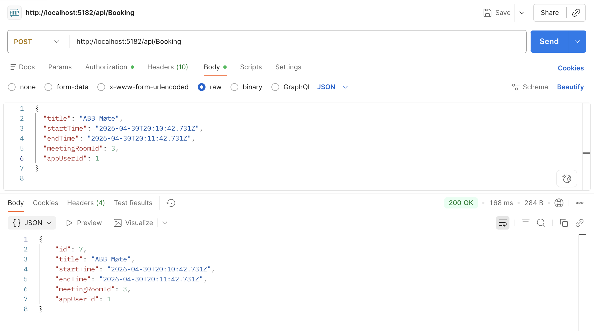
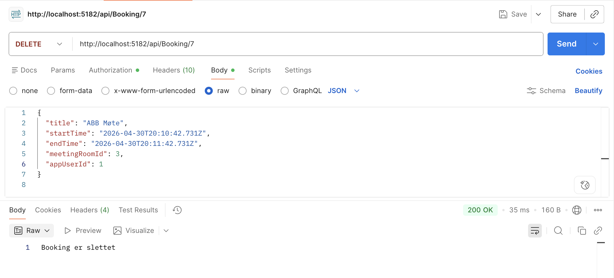
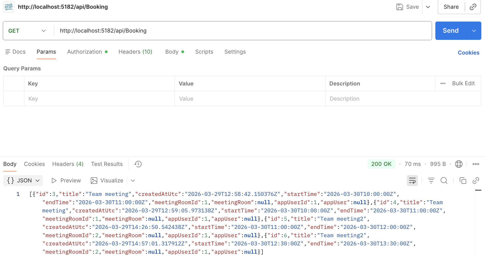
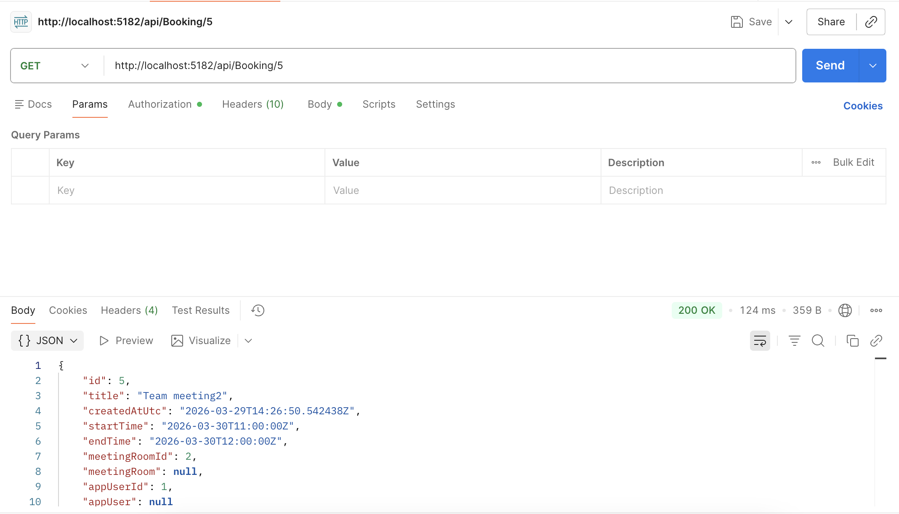
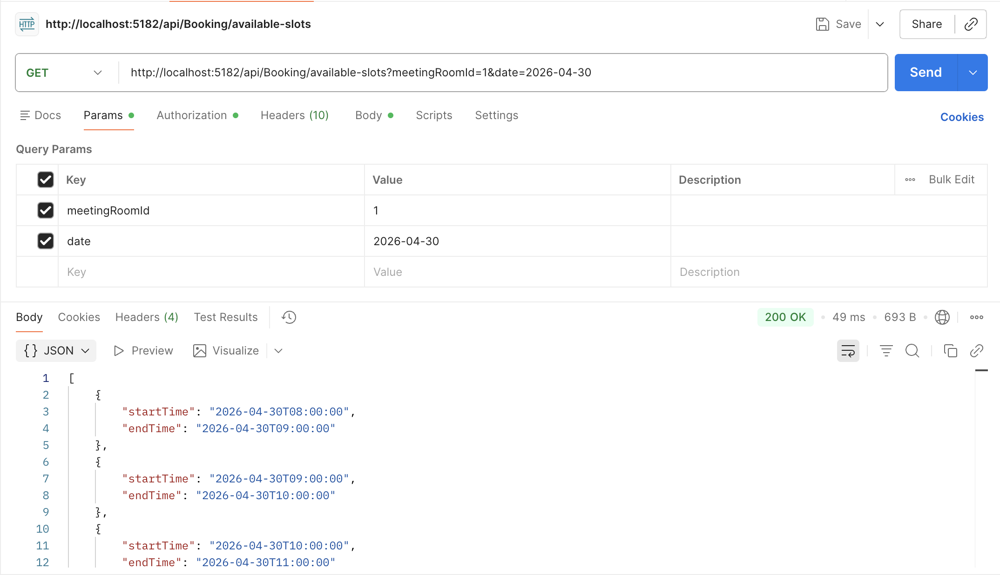
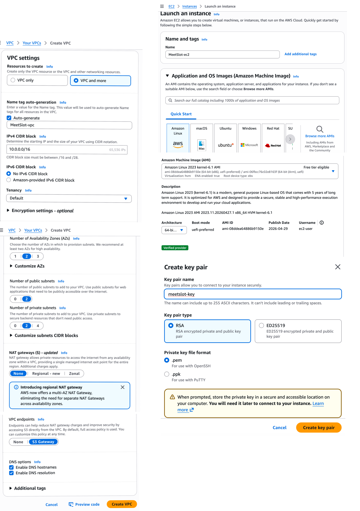
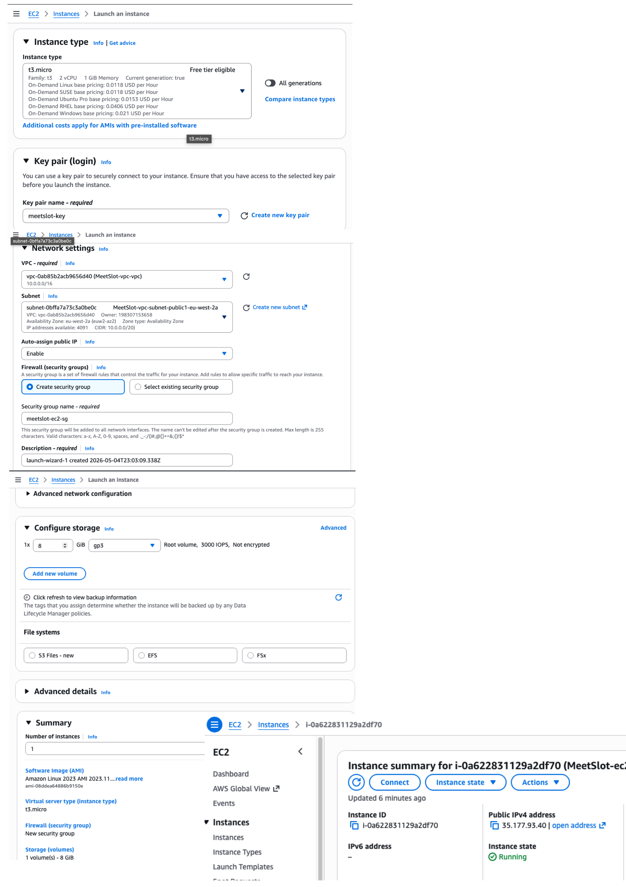

# MeetSlot

Denne README-filen er laget som en midlertidig teamreferanse for prosjektet. Hensikten er a samle prosjektbeskrivelse, teknologivalg, rollefordeling, status og neste steg pa ett sted. Den kan oppdateres fortlopende eller erstattes senere med en mer formell versjon.

## Prosjektbeskrivelse
MeetSlot er et bookingsystem for moterom. Malet er a utvikle en enkel, palitelig og robust applikasjon der brukere kan:
- se tilgjengelige tider
- booke moterom
- avbooke moterom

Systemet skal ha rollebasert tilgang med to hovedroller:
- Admin
- Bruker

Brukere skal i hovedsak kunne handtere egne bookinger, mens admin skal ha utvidet tilgang til administrasjon av systemet.

## Teknologistack
- Backend: ASP.NET Core Web API (C#)
- Frontend (enkel visning i dette steget): Razor Pages
- Data: PostgreSQL
- Lokal utvikling: SQLite kan brukes i development
- ORM: Entity Framework Core, inkludert migreringer og seed-data
- Auth: JWT med rollebasert tilgang
- API-dokumentasjon: Swagger/OpenAPI
- Verktøy: Git, GitHub og Docker
- Planlegging og oppgaveflyt: Trello

### Hvorfor Razor i dette steget
Vi har valgt a bruke Razor Pages for denne enkle frontend-delen fordi det er en teknologi vi har jobbet med i et tidligere emne, og vi onsker a vise at vi behersker den i praksis ogsa i dette prosjektet.

## JWT-token / Auth (notater)
Prosjektet bruker .NET 8 (`net8.0`), så JWT-pakken må matche .NET 8.

- Pakkereferanse: `Microsoft.AspNetCore.Authentication.JwtBearer`
- Anbefalt versjon (for .NET 8): `8.0.x`
- Kommando (eksempel):
  - `dotnet add package Microsoft.AspNetCore.Authentication.JwtBearer --version 8.0.1`

Merk: Hvis man installerer en for ny versjon (f.eks. 10.x), kan man få feil som `NU1202` (ikke kompatibel med `net8.0`).

## Arbeidsmetode
Teamet bruker Agile som rammeverk for a strukturere arbeidet. Samtidig har vi valgt en fleksibel tilnarming til roller, og fordeler oppgaver uten faste Scrum-roller.

Trello brukes som et visuelt arbeidsverktoy for a organisere oppgaver, folge fremdrift og skape oversikt over hva som skal gjores, hva som er under arbeid og hva som er ferdigstilt. Dette bidrar til bedre samarbeid, tydeligere prioriteringer og mer transparens i prosessen.

## Team og ansvarsfordeling
- Semir  (1) - Auth/Security: JWT, roller (`Admin`/`User`) og tilgangsregler
- Ashwaq (2) - DB/EF Core: entities, migreringer, seed-data og constraints
- Ikram  (3) - Availability/Booking logic: timeslots, opprette og avbestille booking, samt forebygging av dobbeltbooking
- Marion (4) - Testing/Docs/DevOps: integrasjonstester, Swagger-polish, README og CI/Docker

## Mitt ansvarsomrade
Min del av prosjektet er database og EF Core.

Dette inkluderer:
- entities og domenemodeller
- migreringer
- seed-data
- constraints og regler i datamodellen

I praksis betyr det ansvar for hvordan dataene struktureres, hvordan relasjonene mellom tabellene bygges opp, hvordan databasen opprettes og oppdateres gjennom migreringer, og hvordan vi sikrer at dataene folger riktige regler og begrensninger.

## Status
Status per 25.03.2026.

Dette er gjort sa langt:
- ASP.NET Core Web API-prosjekt er opprettet pa .NET 8
- Swagger/OpenAPI er satt opp
- Domene-modeller er opprettet:
  - `AppUser`
  - `MeetingRoom`
  - `Booking`
- Rolle-enum for `Admin` og `User` er laget
- `MeetSlotDbContext` er satt opp og registrert i `Program.cs`
- EF Core og PostgreSQL-provider er lagt til i prosjektet
- Viktige database-regler er konfigurert:
  - unik e-post for brukere
  - unikt navn for møterom
  - `Capacity > 0`
  - `EndTime > StartTime`
  - `DeleteBehavior.Restrict` pa relasjoner fra booking
- Booking-tider lagres i UTC for konsistent tidshandtering
- Forste migrering er opprettet: `MeetSlot_v1`
- Migreringen er kjort mot PostgreSQL-databasen `meetslot`
- Seed-data for `AppUser` inkluderer nå både admin (`admin@meetslot.local`) og standardbruker (`user@meetslot.local`)
- Lokal connection string er flyttet til user-secrets i stedet for a ligge hardkodet i repoet
- Prosjektet bygger uten errors

Dette gjenstar:
- implementere seed-data for rom, brukere og eksempelbookinger
- implementere JWT-autentisering og autorisasjon
- lage rollebaserte API-endepunkter for rom, tilgjengelighet, booking og avbooking
- lage logikk for a forhindre dobbeltbooking i bookingflyten
- erstatte standard `weatherforecast`-endepunkt med faktisk MeetSlot-funksjonalitet
- lage Docker-oppsett
- legge til tester og forbedre API-dokumentasjon videre

## Neste steg
1. Implementere videre seed-data for rom, brukere og eksempelbookinger. Jeg fyller databasen med litt testdata automatisk, slik at teamet har noe a jobbe mot. Admin- og standardbruker er lagt inn, neste er flere eksempelbookinger.
2. Klargjore datalaget videre for bookinglogikk og tilgjengelighet
3. Implementere JWT-autentisering og rollebasert tilgang
4. Lage endepunkter for rom, tilgjengelighet, booking og avbestilling
5. Legge til integrasjonstester og videre Swagger-polish
6. Sette opp Docker og CI nar resten av API-flyten er pa plass

## Merknad
Denne README-en er ment som en arbeidsfil for teamet underveis i utviklingen. Den kan senere erstattes med en mer formell README for innlevering, dokumentasjon eller publisering pa GitHub.


# Student 3 – Timeslots, booking create/cancel, double-booking prevention

## Opprettelse av DTO (CreateBookingDto)

Før booking-endepunktet ble implementert, ble det opprettet en egen DTO-klasse kalt `CreateBookingDto`.

DTO står for **Data Transfer Object** og brukes for å kontrollere hvilke data klienten sender inn til API-et.

I stedet for å sende hele `Booking`-entiteten direkte, ble DTO brukt for å begrense input til kun nødvendige felt:

* Title
* StartTime
* EndTime
* MeetingRoomId
* AppUserId

Dette ble gjort for å:

* unngå at klienten sender navigasjonsegenskaper som `MeetingRoom` og `AppUser`
* redusere risiko for serialiseringsproblemer
* gjøre input tydeligere i Swagger

DTO-filen ble opprettet i prosjektmappen:    `Dtos/CreateBookingDto.cs`

---

## 1. POST - endepunkt for booking  `POST /api/Booking`

Et `BookingController` ble opprettet for å håndtere bookinglogikken.

Første implementasjon av `POST /api/Booking` gjorde følgende:

* mottok bookingdata via `CreateBookingDto`
* hentet valgt møterom fra databasen
* hentet valgt bruker fra databasen
* opprettet et nytt `Booking`-objekt
* lagret bookingen med `_context.SaveChanges()`

---

### 1. Validering lagt til i booking-endepunktet

Etter første test ble flere kontroller lagt til:

#### Kontroll av møterom

API-et sjekker om `MeetingRoomId` finnes i databasen.

Hvis rommet ikke finnes: `BadRequest("Møterommet ble ikke funnet")`

#### Kontroll av bruker

API-et sjekker om `AppUserId` finnes i databasen.

Hvis brukeren ikke finnes: `BadRequest("Brukeren ble ikke funnet")`

#### Kontroll av tid

API-et sjekker at sluttidspunkt er etter starttidspunkt.

Hvis `EndTime <= StartTime`:
**BadRequest("Slutttidspunkt må være etter starttidspunkt")**

---

### 2. Forebygging av dobbeltbooking

Det ble lagt inn logikk for å forhindre at samme møterom bookes i overlappende tidsrom.

Kontrollen ble gjort med:

```csharp
var hasConflict = _context.Bookings.Any(b =>
    b.MeetingRoomId == dto.MeetingRoomId &&
    dto.StartTime < b.EndTime &&
    dto.EndTime > b.StartTime);
```

Hvis konflikten finnes:

`BadRequest("Dette rommet er allerede booket for det valgte tidspunktet.")`

Denne logikken sikrer at to bookinger ikke kan overlappe i samme møterom.

---


### 3. Testing i Swagger

Endepunktet ble testet i Postman og Swagger med JSON-request.


#### Gyldig booking

- Booking ble lagret i databasen og verifisert i DBeaver. `200 OK`

#### Ugyldig booking

- Ved overlappende tidspunkt returnerte API-et: `400 Bad Request`

med melding:

`Dette rommet er allerede booket for det valgte tidspunktet.`

Dette bekrefter at booking-logikken fungerer som forventet.


## 2. DELETE - endepunkt for booking  `DELETE /api/Booking/{id}`

Dette endpointet brukes for å slette en eksisterende booking fra databasen.  

Endpointen søker først etter booking med gitt id.  
Hvis booking ikke finnes, returneres en feil (`404 NotFound`).  
Hvis booking finnes, fjernes den fra databasen og endringene lagres.  

**Route:** `DELETE /api/Booking/{id}`

**Eksempel:** `DELETE /api/Booking/7`


**Resultat:**
- booking slettes hvis den finnes
- feil returneres hvis booking ikke eksisterer


## 3. GET - endepunkt for booking  `GET /api/Booking`

Dette endpointet brukes for å hente alle bookinger fra databasen.

Systemet leser alle booking-objekter og returnerer dem som en liste.

**Route:** `GET /api/Booking`


**Resultat:**
- returnerer alle registrerte bookinger


## 4. GET - endepunkt for booking  `GET /api/Booking/{id}`
Dette endpointet brukes for å hente én booking basert på id.

Systemet søker etter booking i databasen.  
Hvis booking finnes, returneres objektet.  
Hvis booking ikke finnes, returneres `404 NotFound`.  

**Route:** `GET /api/Booking/{id}`

**Eksempel:** `GET /api/Booking/5`

**Resultat:**
- returnerer valgt booking hvis den finnes
- feil hvis booking ikke eksisterer

## 5. GET - endepunkt for booking  `GET /api/Booking/available-slots?meetingRoomId={id}&date={yyyy-MM-dd}`

### Available slots endpoint
Dette endpointet brukes for å hente ledige tider for et møterom på en valgt dato.

Systemet oppretter først mulige timeslots innenfor arbeidstiden.
Deretter sammenlignes disse med eksisterende bookinger for å finne hvilke slots som er ledige.

**Route:** `GET /api/Booking/available-slots?meetingRoomId={id}&date={yyyy-MM-dd}`

**Eksempel:** `GET /api/Booking/available-slots?meetingRoomId=1&date=2026-04-30`

**Resultat:**
- returnerer ledige tider for valgt møterom
- returnerer feil hvis møterommet ikke finnes


## Steg: Enkel Razor Pages frontend lokalt (`/rooms`)

For dette steget lager vi en enkel, men mer visuell frontend-visning i samme prosjekt, slik at vi kan se møterommene direkte i nettleseren uten a bygge hele frontend-stacken først.

Målet er:
- en fungerende side pa `https://localhost:{PORT}/rooms`
- siden henter data fra databasen via `MeetSlotDbContext`
- viser møterom med navn, kapasitet og beskrivelse i et kort-basert layout

Dette steget er ment for lokal utvikling og rask verifisering av dataflyt i prosjektet.

### Steg 1 - Oppdater `Program.cs`

Legg til `AddRazorPages()` sammen med de andre services:

```csharp
builder.Services.AddRazorPages();
```

Legg til `MapRazorPages()` rett før `app.Run()`:

```csharp
app.MapRazorPages();
```

Status na: dette er allerede lagt inn i `Program.cs`.

### Steg 2 - Lag `Pages`-mappen og filene

Opprett:
- `Pages/Rooms.cshtml`
- `Pages/Rooms.cshtml.cs`

I dette prosjektet er disse filene allerede opprettet lokalt.

### Steg 3 - Hent møterom fra databasen

I `Pages/Rooms.cshtml.cs` hentes data med `MeetSlotDbContext` fra `_context.MeetingRooms`, og resultatet vises i `Pages/Rooms.cshtml` med:
- navn
- kapasitet
- beskrivelse

I viewet er presentasjonen oppdatert med:
- toppseksjon (hero) med antall rom og total kapasitet
- grid av romkort for bedre oversikt
- enkel lokal styling for rask prototype-visning

### Steg 4 - Direkte routing til `/rooms`

Vi sender brukeren direkte til `/rooms` fra rot-url (`/`) fordi dette er den eneste frontend-siden i dette steget, og den representerer hovedfunksjonen vi vil demonstrere.

Dette gir tre fordeler:
- unngar tom/hvit side på `/` under lokal testing
- gjør demo-flyten enklere for teamet (appen åpner rett sted)
- samsvarer med `launchSettings` som nå bruker `rooms` som `launchUrl`

Implementert i `Program.cs`:

```csharp
app.MapGet("/", () => Results.Redirect("/rooms"));
```

### Steg 5 - Filterpills i romoversikt

For a gjøre oversikten mer brukervennlig er det lagt til filterpills i `Rooms.cshtml`.

Brukeren kan filtrere rom visuelt etter kapasitet:
- Alle
- Liten (1-4)
- Medium (5-8)
- Stor (9+)

Filteret er laget med enkel JavaScript + CSS i samme Razor-side, uten ny backend-logikk.
Hvert romkort har `data-capacity` slik at filteret kan vise/skjule kort lokalt i nettleseren.

### Steg 6 - Book-knapp og `ComingSoon`-side (under utvikling)

Det er opprettet en egen Razor Page for "under utvikling":
- `Pages/ComingSoon.cshtml`
- `Pages/ComingSoon.cshtml.cs`

Siden viser en tydelig og vennlig melding fram til bookingflyten er ferdig koblet, og fungerer som midlertidig målside for booking-knapper.

Status na:
- `ComingSoon`-siden er implementert og bygger uten feil
- neste kobling er a sende "Book" fra romkortene til `/comingsoon`

### Kort test lokalt

1. Kjør prosjektet lokalt (`dotnet run` eller fra VS Code)
2. Åpne nettleser pa `https://localhost:{PORT}/rooms`
3. Verifiser at listen viser møterom fra databasen

Hvis listen er tom, sjekk at databasen er migrert og at seed-data for `MeetingRooms` finnes.


# Docker-oppsett

## 1. Bytt til riktig branch
Prosjektet kan kjøres lokalt med Docker ved hjelp av `Dockerfile` og `docker-compose.yml`. 

```bash
git checkout main     
git pull origin main
git checkout -b docker-setup
```  


## 2. Bygg og start containerne
```bash
docker compose up --build
```
Applikasjonen kjører på:   http://localhost:5182

## 3. Kjør Entity Framework migrations
Første gang containerne startes, er databasen tom. Hvis du får en feil som:
```bash
relation "MeetingRooms" does not exist
```
kjør EF Core migrations fra prosjektmappen:
```bash
ConnectionStrings__DefaultConnection="Host=localhost;Port=5433;Database=meetslot;Username=postgres;Password=postgres" dotnet ef database update
```
Dette oppretter databasetabellene og legger inn seed-data.

## 4. Test applikasjonen
Åpne UI Pages-siden:    http://localhost:5182/rooms  
Test Booking API-et:    http://localhost:5182/api/Booking  
Hvis det ikke finnes bookinger ennå, skal responsen være:
```bash
[]
```
Åpne Swagger:          http://localhost:5182/swagger  

## 5. Testing alle endepunkter
Eksempler på endepunkter:
- GET     /api/Booking
- GET     /api/Booking/{id}
- POST    /api/Booking
- DELETE  /api/Booking/{id}
- GET     /api/Booking/available-slots
- POST    /api/Auth/register
- POST    /api/Auth/login


## 6. Stopp Docker
```bash
docker compose down
```


# Deploy MeetSlot til AWS EC2 med Docker, PostgreSQL og Nginx

## Introduksjon

I denne delen ble MeetSlot-applikasjonen deployert til en AWS EC2-instans.  
API- og Nginx-images ble hentet direkte fra Docker Hub, mens PostgreSQL ble kjørt som en container på EC2-instansen.

Målet var å gjøre applikasjonen offentlig tilgjengelig via EC2-instansens public IP-adresse, og samtidig bruke Nginx som reverse proxy foran API-et.

---

### Infrastruktur

Følgende infrastruktur ble brukt:

- Egen VPC i AWS
- EC2-instans med Amazon Linux
- Security Group konfigurert med:
  - SSH (22) – kun egen IP
  - HTTP (80) – offentlig tilgang
  - Port 8080 / 5182 ble ikke eksponert offentlig i AWS
- Docker og Docker Compose
- PostgreSQL-container
- API-container
- Nginx-container

---
## 1. Opprettelse av VPC
En egen VPC ble opprettet i AWS for å isolere infrastrukturen.

VPC-en ble opprettet med public og private subnets.  
EC2-instansen ble plassert i et public subnet slik at den kunne nås via SSH og HTTP.  

## 2. Opprettelse av EC2-instans
En EC2-instans ble opprettet innenfor den nye VPC-en.  
Instansen ble konfigurert med public IP og riktig Security Group.  




## 3. Tilkobling til EC2 via SSH 

Private key ble gitt riktige rettigheter:  
`Terminal `
```
ikram@Ikram-sin-MacBook-Pro Downloads % ls
meetslot-key.pem

chmod 400 meetslot-key.pem
ssh -i meetslot-key.pem ec2-user@35.177.93.40
```

## 4. Installasjon av Docker på EC2
Docker ble installert på Amazon Linux:  
**SSH Terminal**:
```
sudo yum update -y
sudo yum install docker -y        
sudo systemctl start docker       
sudo systemctl enable docker      
sudo usermod -aG docker ec2-user 
 
exit
```
Etter reinstallering av SSH-tilkobling ble Docker verifisert:
```
ssh -i meetslot-key.pem ec2-user@35.177.93.40
```
**SSH Terminal**:
```
[ec2-user@ip-10-0-12-21 ~]$ docker --version
Docker version 25.0.14, build 0bab007
[ec2-user@ip-10-0-12-21 ~]$ docker ps
CONTAINER ID   IMAGE     COMMAND   CREATED   STATUS    PORTS     NAMES
```

## 5. Installasjon av Docker Compose
Docker Compose v2 ble installert manuelt
**SSH Terminal**:
```
sudo mkdir -p /usr/local/lib/docker/cli-plugins
sudo curl -SL https://github.com/docker/compose/releases/download/v2.29.2/docker-compose-linux-x86_64 \
  -o /usr/local/lib/docker/cli-plugins/docker-compose
sudo chmod +x /usr/local/lib/docker/cli-plugins/docker-compose
```

Verifisering:
```
ec2-user@ip-10-0-12-21 ~]$ docker compose version
Docker Compose version v2.29.2
```


## 6. Opprettelse av Nginx-image
For å gjøre API-et tilgjengelig på port 80 ble Nginx brukt som reverse proxy.
Det ble opprettet en egen mappe for Nginx:
```
nginx/
  default.conf
  Dockerfile
```

Nginx-image ble bygget og pushet til Docker Hub:
```
docker build -t ikramenwer/meetslot-nginx:latest ./nginx
docker push ikramenwer/meetslot-nginx:latest
```


## 7. Opprettelse av docker-compose.yml på EC2
Følgende filer ble brukt på EC2:  
- docker-compose.yml
- meetslot_migration.sql 

Opprettelse av `docker-compose.yml` på EC2:
```
[ec2-user@ip-10-0-12-21 ~]$ nano docker-compose.yml
```


`docker-compose.yml`

```yml
services:
  db:
    image: postgres:16
    container_name: meetslot-db
    restart: unless-stopped
    environment:
      POSTGRES_DB: meetslot
      POSTGRES_USER: postgres
      POSTGRES_PASSWORD: postgres
    volumes:
      - meetslot_pgdata:/var/lib/postgresql/data

  api:
    image: ikramenwer/meetslot-api:latest
    container_name: meetslot-api
    restart: unless-stopped
    depends_on:
      - db
    environment:
      ASPNETCORE_ENVIRONMENT: Production
      ASPNETCORE_URLS: http://+:8080
      ConnectionStrings__DefaultConnection: Host=db;Port=5432;Database=meetslot;Username=postgres;Password=postgres
      Jwt__Issuer: MeetSlot
      Jwt__Audience: MeetSlotUsers
      Jwt__Key: ThisIsADevelopmentSecretKeyForMeetSlot12345

  nginx:
    image: ikramenwer/meetslot-nginx:latest
    container_name: meetslot-nginx
    restart: unless-stopped
    ports:
      - "80:80"
    depends_on:
      - api

volumes:
  meetslot_pgdata:
 ``` 

CTRL+O → Enter → CTRL+X


verifisering:
```
cat docker-compose.yml
```

## 8. Docker Compose-konfigurasjon
`docker-compose.yml` bruker images fra **Docker Hub**:  
- ikramenwer/meetslot-api:latest
- ikramenwer/meetslot-nginx:latest  


Løsningen startes med:
```
docker compose pull
docker compose up -d
```
Dette starter:
- PostgreSQL-container
- API-container
- Nginx-container 


## 9. Verifisering på EC2
Container-status:
```
[ec2-user@ip-10-0-12-21 ~]$ docker ps
CONTAINER ID   IMAGE                              COMMAND                  CREATED        STATUS        PORTS                               NAMES
40449a4bf592   ikramenwer/meetslot-nginx:latest   "/docker-entrypoint.…"   16 hours ago   Up 16 hours   0.0.0.0:80->80/tcp, :::80->80/tcp   meetslot-nginx
a90284be4aa2   ikramenwer/meetslot-api:latest     "dotnet MeetSlot.dll"    16 hours ago   Up 16 hours   8080/tcp                            meetslot-api
574797e68c28   postgres:16                        "docker-entrypoint.s…"   16 hours ago   Up 16 hours   5432/tcp                            meetslot-db
```

## 10. Kjøring av database migrations på EC2

Etter at containerne ble startet, ble applikasjonen testet via `/rooms`.  
Først oppstod følgende feil i API-loggene:

```txt
relation "MeetingRooms" does not exist
```
Dette betydde at PostgreSQL-databasen var opprettet, men at Entity Framework migrations ikke var kjørt.

API-containeren inneholdt kun .NET runtime, og derfor kunne ikke dotnet ef database update kjøres direkte inne i containeren:
```
No .NET SDKs were found.
```
Derfor ble det laget et SQL-script lokalt fra prosjektmappen:
```
dotnet ef migrations script -o meetslot_migration.sql
```
SQL-filen ble overført til EC2:
```
scp -i ~/Downloads/meetslot-key.pem meetslot_migration.sql ec2-user@35.177.93.40:~
```
På EC2 ble filen kontrollert:
```
[ec2-user@ip-10-0-12-21 ~]$ ls
docker-compose.yml  meetslot_migration.sql
```
SQL-filen ble kopiert inn i PostgreSQL-containeren:
```
docker cp meetslot_migration.sql meetslot-db:/meetslot_migration.sql
```
Migration-scriptet ble kjørt mot databasen:
```
docker exec -it meetslot-db psql -U postgres -d meetslot -f /meetslot_migration.sql
```


## 11. Testing

Nettsiden ble testet lokalt på EC2:

```bash
curl http://localhost/rooms
```
Samme side ble også testet i nettleser via public IP:
```
http://35.177.93.40/rooms
```

### 1.Testing lokalt på EC2:
```
[ec2-user@ip-10-0-12-21 ~]$ curl -X POST http://localhost/api/Auth/login \
  -H "Content-Type: application/json" \
  -d '{"email":"admin@meetslot.local","password":"Admin123!"}'
{"token":"eyJhbGciOiJIUzI1NiIsInR..."}

[ec2-user@ip-10-0-12-21 ~]$ TOKEN="eyJhbGciOiJIUzI1NiIsInR..."

[ec2-user@ip-10-0-12-21 ~]$ curl -X GET http://localhost/api/Booking/1 \
  -H "Authorization: Bearer $TOKEN"
{"id":1,"title":"Valid booking test","createdAtUtc":"2026-05-07T02:22:15.068993Z","startTime":"2026-05-10T10:00:00Z","endTime":"2026-05-10T11:00:00Z","meetingRoomId":1,"meetingRoom":null,"appUserId":1,"appUser":null}
```

### 2. Testing via Public IP via Postman

POST http://35.177.93.40/api/Auth/register

POST http://35.177.93.40/api/Auth/login

POST http://35.177.93.40/api/Booking

DELETE http://35.177.93.40/api/Booking/{id}

GET http://35.177.93.40/api/Booking

GET http://35.177.93.40/api/Booking/{id}

GET http://35.177.93.40/api/Booking/available-slots?meetingRoomId={id}&date={yyyy-MM-dd}


## Konklusjon

MeetSlot ble deployert til AWS EC2 med Docker Compose.  
Løsningen kjører med PostgreSQL, API og Nginx som separate containere.

Nginx eksponerer applikasjonen på port 80, mens API-et kjører internt på port 8080.  
PostgreSQL-databasen kjører internt i Docker-nettverket, og Entity Framework migrations ble kjørt med et SQL-script.

Resultatet er at applikasjonen er tilgjengelig via EC2-instansens public IP, og både nettsiden og API-endepunktene fungerer.
